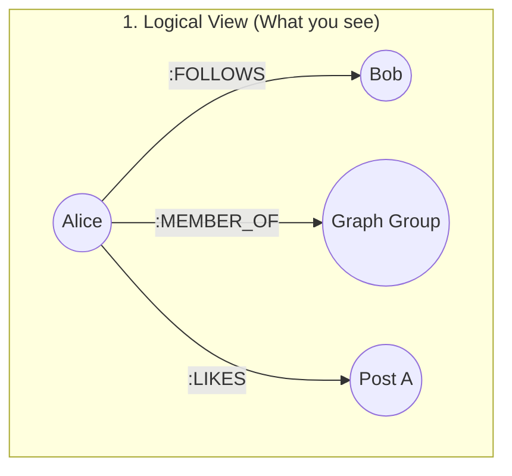
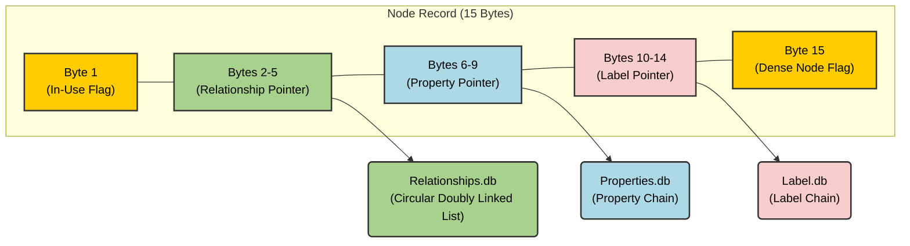

# Phase 1: Foundations & The Graph Mindset

## 1. Comparative Architecture

| Concept       | Postgres (SQL)           | Mongoose (NoSQL)        | Neo4j (Graph)        |
| :------------ | :----------------------- | :---------------------- | :------------------- |
| **Storage**   | Tables/Rows              | Documents               | Nodes/Relationships  |
| **M2M**       | Join Tables              | Arrays of IDs / $lookup | Direct Relationships |
| **Traversal** | Index Lookups (O(log N)) | Aggregation Pipelines   | Pointers (O(1))      |
| **Schema**    | Rigid                    | Flexible                | Schema-lite (Labels) |

## 2. The Core Secret: Index-Free Adjacency

In SQL, finding a connection requires scanning an index. In Neo4j, each node physically stores the address of its neighbors. This means the query speed is proportional to the size of the _result set_, not the _total dataset_.

### Under the Hood: The Doubly Linked List

Neo4j stores relationships as a circular doubly linked list per node.

- **Node Record:** Points to the `First Relationship`.
- **Relationship Record:** Points to `Next` and `Prev` for both the start and end nodes.
- **Complexity:** Traversing a relationship is a constant time $O(1)$ operation (pointer chasing).
- **Trade-off:** Deleting or inserting relationships requires updating these pointers, making writes heavier than a simple SQL `INSERT`.

#### 2.1 The Scenario: Alice's Social Activity

To understand the storage, let's look at Alice's logical connections:

1. Alice **FOLLOWS** Bob.
2. Alice is a **MEMBER_OF** the "Graph Theory" Group.
3. Alice **LIKES** a Post about "Index-Free Adjacency".

In a Relational DB, these would be 3 rows in 3 different join tables. In Neo4j, these are 3 relationship records in **Alice's personal linked list**.

#### Visualizing the Pointer Chain (Logical to Physical)



### 2.2 The 1% Architect's Distinction: Logical vs. Physical
It is vital to understand that `FirstRel` and `FirstProp` are **not** user-defined attributes; they are internal storage pointers.

| Feature | Logical (Cypher) | Physical (Disk Record) |
| :--- | :--- | :--- |
| **Node Identity** | `(n:User)` | Fixed 15B Record (ID, Labels, Pointer). |
| **Relationships** | `-[:FOLLOWS]->` | Circular Doubly Linked List (Pointer Chasing). |
| **Properties** | `{name: 'Alice'}` | Separate Property Store (Linked List of values). |

**Why this matters:** When you query `n.name`, the engine has to jump from the **Node Store** to the **Property Store**. This is why traversals (moving node-to-node) are faster than property scans (reading every name in the DB).

### 2.3 The 15-Byte Node Record Anatomy

This diagram precisely illustrates the internal structure of a Neo4j node record on disk, showing how its 15 fixed bytes are allocated to flags and pointers.



## 3. Cypher vs. SQL

**SQL:**

```sql
SELECT f2.name
FROM users u1
JOIN follows f1 ON u1.id = f1.follower_id
JOIN follows f2 ON f1.followed_id = f2.follower_id
WHERE u1.name = 'Alice';
```

**Cypher:**

```cypher
MATCH (alice:User {name: 'Alice'})-[:FOLLOWS*2]->(fof)
RETURN fof.name
```

## 4. The Challenge: Cycle Detection

**Context:** In LeetCode, you'd use DFS with a `visited` set to find a cycle.
**Cypher Goal:** Find a 3-person loop: `(A)->(B)->(C)->(A)`.

**Solution Hint:**

```cypher
MATCH (a:User)-[:FOLLOWS]->(b)-[:FOLLOWS]->(c)-[:FOLLOWS]->(a)
RETURN a, b, c
```

_Why is this better?_ Cypher handles the recursion and backtracking internally using its graph engine.

## Next Steps

- [ ] Install Neo4j Desktop or use Neo4j Aura (Free Tier).
- [ ] Run the `:play movie-graph` tutorial.
