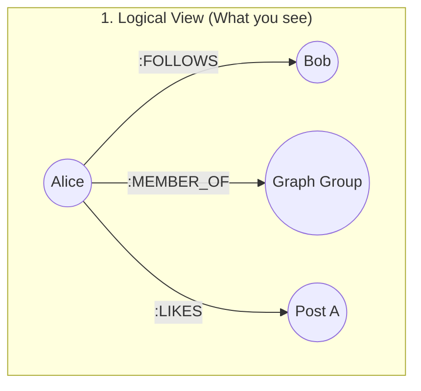
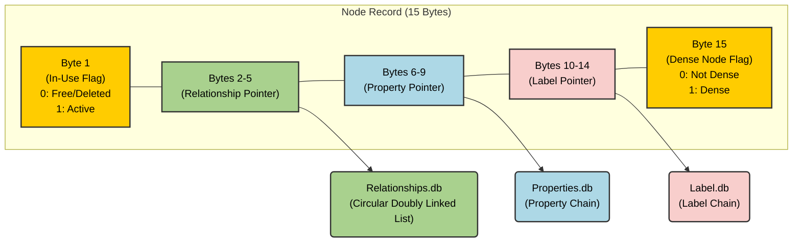
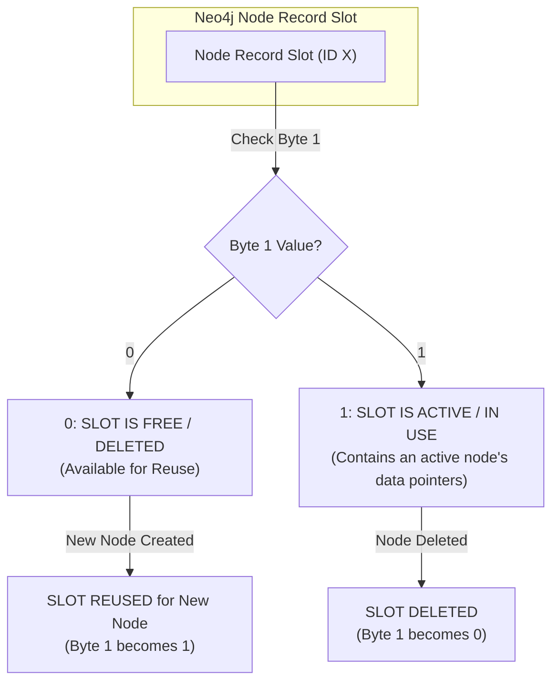
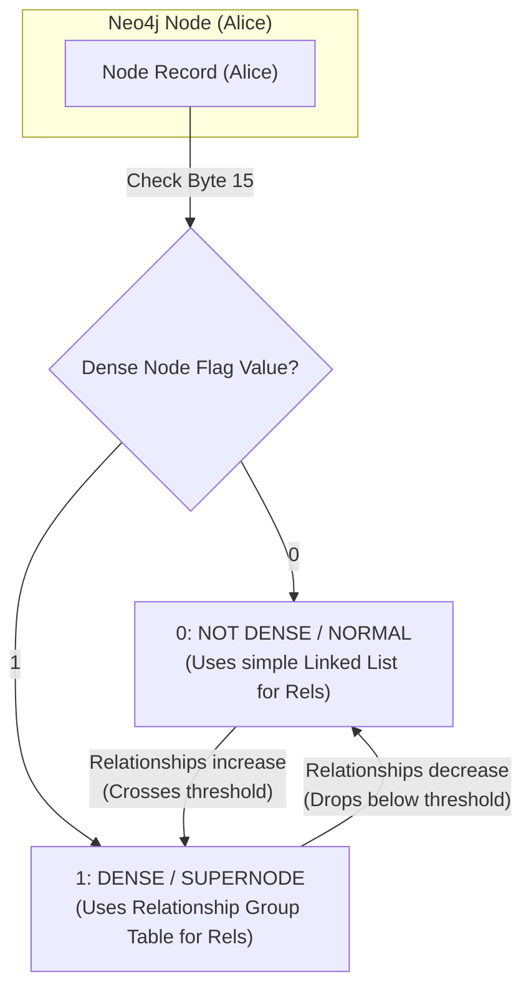
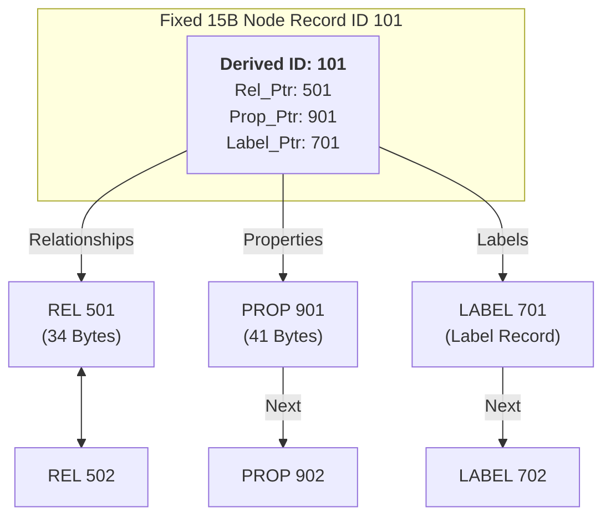
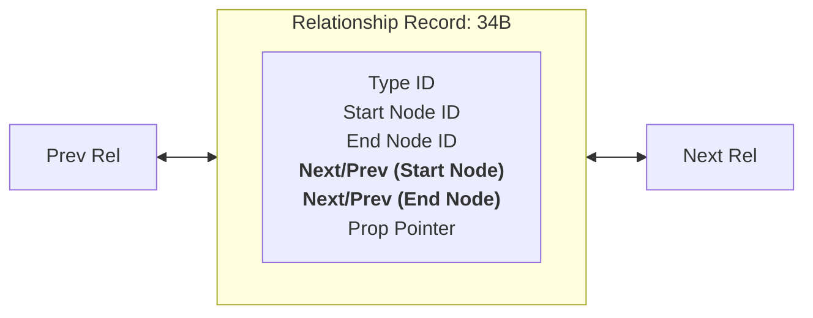
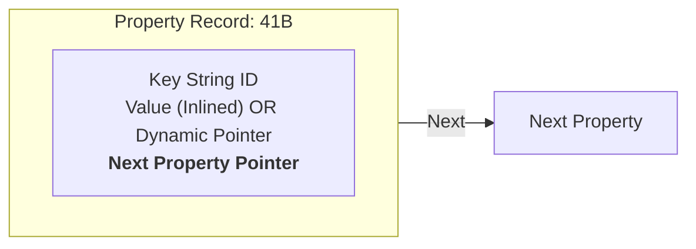
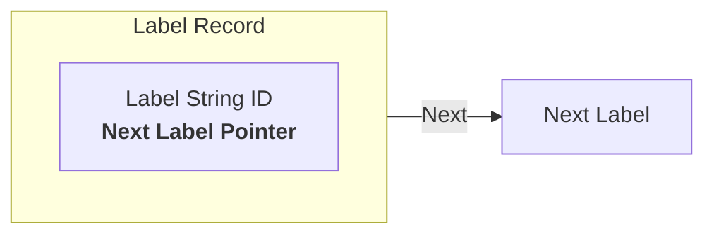

# Phase 1: Foundations & The Graph Mindset

## 1. Comparative Architecture

| Concept       | Postgres (SQL)           | Mongoose (NoSQL)        | Neo4j (Graph)        |
| :------------ | :----------------------- | :---------------------- | :------------------- |
| **Storage**   | Tables/Rows              | Documents               | Nodes/Relationships  |
| **M2M**       | Join Tables              | Arrays of IDs / $lookup | Direct Relationships |
| **Traversal** | Index Lookups (O(log N)) | Aggregation Pipelines   | Pointers (O(1))      |
| **Schema**    | Rigid                    | Flexible                | Schema-lite (Labels) |

## 2. The Core Secret: Index-Free Adjacency

In SQL, finding a connection requires scanning an index. In Neo4j, each node physically stores the address of its neighbors. This means the query speed is proportional to the size of the _result set_, not the _total dataset_.

### Under the Hood: The Doubly Linked List

Neo4j stores relationships as a circular doubly linked list per node.

- **Node Record:** Points to the `First Relationship`.
- **Relationship Record:** Points to `Next` and `Prev` for both the start and end nodes.
- **Complexity:** Traversing a relationship is a constant time $O(1)$ operation (pointer chasing).
- **Trade-off:** Deleting or inserting relationships requires updating these pointers, making writes heavier than a simple SQL `INSERT`.

#### 2.1 The Scenario: Alice's Social Activity

To understand the storage, let's look at Alice's logical connections:

1. Alice **FOLLOWS** Bob.
2. Alice is a **MEMBER_OF** the "Graph Theory" Group.
3. Alice **LIKES** a Post about "Index-Free Adjacency".

In a Relational DB, these would be 3 rows in 3 different join tables. In Neo4j, these are 3 relationship records in **Alice's personal linked list**.

#### Visualizing the Pointer Chain (Logical to Physical)



### 2.2 The 1% Architect's Distinction: Logical vs. Physical

It is vital to understand that `FirstRel` and `FirstProp` are **not** user-defined attributes; they are internal storage pointers.

| Feature           | Logical (Cypher)  | Physical (Disk Record)                           |
| :---------------- | :---------------- | :----------------------------------------------- |
| **Node Identity** | `(n:User)`        | Fixed 15B Record (ID, Labels, Pointer).          |
| **Relationships** | `-[:FOLLOWS]->`   | Circular Doubly Linked List (Pointer Chasing).   |
| **Properties**    | `{name: 'Alice'}` | Separate Property Store (Linked List of values). |

**Why this matters:** When you query `n.name`, the engine has to jump from the **Node Store** to the **Property Store**. This is why traversals (moving node-to-node) are faster than property scans (reading every name in the DB).

### 2.3 The 15-Byte Node Record Anatomy

This diagram precisely illustrates the internal structure of a Neo4j node record on disk, showing how its 15 fixed bytes are allocated to flags and pointers.



## 3. Cypher vs. SQL

**SQL:**

```sql
SELECT f2.name
FROM users u1
JOIN follows f1 ON u1.id = f1.follower_id
JOIN follows f2 ON f1.followed_id = f2.follower_id
WHERE u1.name = 'Alice';
```

**Cypher:**

```cypher
MATCH (alice:User {name: 'Alice'})-[:FOLLOWS*2]->(fof)
RETURN fof.name
```

## 4. The Challenge: Cycle Detection

**Context:** In LeetCode, you'd use DFS with a `visited` set to find a cycle.
**Cypher Goal:** Find a 3-person loop: `(A)->(B)->(C)->(A)`.

**Solution Hint:**

```cypher
MATCH (a:User)-[:FOLLOWS]->(b)-[:FOLLOWS]->(c)-[:FOLLOWS]->(a)
RETURN a, b, c
```

_Why is this better?_ Cypher handles the recursion and backtracking internally using its graph engine.

## Next Steps

- [ ] Install Neo4j Desktop or use Neo4j Aura (Free Tier).
- [ ] Run the `:play movie-graph` tutorial.

### 2.4 Zooming on Byte 1 (In-Use Flag): Node Lifecycle & ID Reuse

This flag dictates the state of the 15-byte node record and is central to how Neo4j manages its fixed-size storage and reuses internal IDs.

#### 1. Active Node Lifecycle (Byte 1 = 1)

When you create a node (e.g., `CREATE (n:User {name:'Alice'})`), Neo4j performs the following steps:

- **Allocates ID:** Neo4j finds a free 15-byte slot in `nodes.db` and assigns it an internal ID (e.g., 101).
- **Sets Flag:** It sets Byte 1 of that record to `1` (Active).
- **Sets Pointers:** It populates the other 3 pointers (Relationships, Properties, Labels) to point to the start of Alice's data in their respective stores.
  When you then search for this node (`MATCH (a) WHERE id(a) = 101`), Neo4j simply calculates the exact byte offset for ID 101 in `nodes.db`, jumps there, and checks Byte 1. If it's `1`, the node is active and can be used. This is an extremely fast $O(1)$ lookup.

#### 2. Node Deletion & ID Reuse Cycle (Byte 1 = 0)

This illustrates the critical concept of internal ID reuse, a direct consequence of fixed-size records and the In-Use flag.

**Phase 1: Node Creation (Alice)**

- Alice is created, receiving Node ID 101. Her Node Record's Byte 1 is `1` (Active).

**Phase 2: Node Deletion (Alice)**

- When you delete Alice (`DELETE (n:User {name:'Alice'})`), Neo4j doesn't physically erase her record. Instead, it flips Byte 1 of Node ID 101's record to `0` (Free). The slot is now available for reuse.

**Phase 3: ID Reuse (Bob)**

- Later, if you create a new node (`CREATE (m:User {name:'Bob'})`), Neo4j will scan for available slots. It finds Node ID 101 (whose Byte 1 is `0`) and reuses it for Bob.
- Node ID 101's record now stores Bob's information, and its Byte 1 is flipped back to `1` (Active).

**Phase 4: Ambiguous Lookup (If you rely on ID)**

- If your application then tries to `MATCH (x) WHERE id(x) = 101` expecting Alice, it will now find Bob, because Node ID 101 points to Bob.

\*\*This lifecycle highlights why relying on `id(n)` in application code is an anti-pattern; it's a transient, internal address, not a stable identifier.

### 2.5 Simplified View: The In-Use Flag in Action (Byte 1)

This flowchart distills the behavior of Neo4j's node records based solely on the value of Byte 1.



### 2.6 Simplified View: The Dense Node Flag in Action (Byte 15)

This flowchart illustrates the behavior of the Dense Node Flag, which dictates how relationships are stored for a given node.



### 2.7 The Three Pointers: Entry Points to Variable-Sized Data


This diagram illustrates how the 15-byte Node Record, a fixed-size entry, uses its three pointers to access an arbitrary number of relationships, properties, and labels, each managed as its own linked list in separate storage files.


**Important Note on Flags and ID:**

*   The **Node ID** (e.g., 101) is not stored *within* the 15 bytes. It is the *offset* of this 15-byte record within the `nodes.db` file (ID * 15 Bytes = disk offset).

*   The **In-Use Flag** (Byte 1) and **Dense Node Flag** (Byte 15) *are* part of these 15 bytes, as shown in **Section 2.3 (The 15-Byte Node Record Anatomy)**. This diagram focuses on the *pointers* themselves, which start at Bytes 2, 6, and 10.





### 2.8 Internal Record Anatomy (What they hold)


To be a 1% architect, you must know what is inside these blocks. This allows you to understand why **Graph Traversals** are faster than **Table Joins**.


#### A. Relationship Record (34 Bytes) - Doubly Linked


Every relationship is a fixed-size block that acts as a "hub" connecting two nodes.





#### B. Property Record (41 Bytes) - Singly Linked


Properties are stored in a separate chain to keep the Node/Rel records small and fast.





1. **Property Key ID:** Pointer to the string store (e.g., "email", "age").


2. **Property Value:** 


    - **Inlined Data:** Integers, Booleans, and very short strings are stored **directly** in these 41 bytes.


    - **Overflow Pointer:** If the data is a long string or an array, this field holds a pointer to the **Dynamic Store**.


3. **Next Property ID:** Pointer to the next property in the chain for that Node/Rel.


#### C. The Dynamic Store (The "Big Data" Bin)


When a property value is too large for the 41-byte record (like a 500-word bio), Neo4j breaks it into a linked list of **Dynamic Records**.


- **Performance Impact:** Reading an inlined Integer is $O(1)$. Reading a long string is $O(N)$ where $N$ is the number of dynamic blocks.


#### D. Label Record - Singly Linked


A simple record holding the Label ID and a pointer to the `Next Label`.





***


### 1% Architect's Note: Linkage Strategy

Notice the difference in the arrows above:

- **Relationships (<-->):** Use **Doubly Linked Lists**. This allows Neo4j to delete a relationship or traverse "backwards" through a chain without restarting at the Node record.

- **Properties & Labels (-->):** Use **Singly Linked Lists**. To save disk space and RAM, these only point forward. Since properties are usually read as a complete set from the start, "backward" pointers are unnecessary overhead.


        


