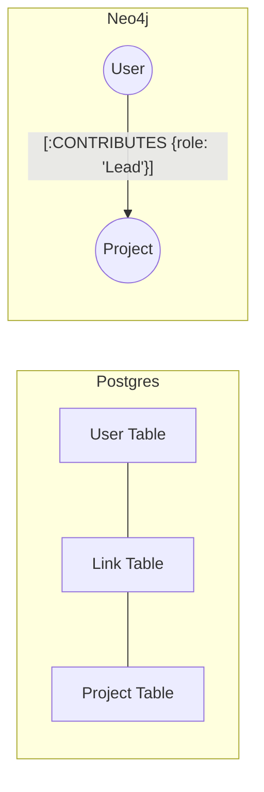

# Phase 2: Advanced Data Modeling

## 1. The "Join Table" Refactor
In Postgres, a `UserProject` table stores `user_id`, `project_id`, and `role`. 
**Anti-pattern:** Creating a `UserProject` node.
**The Graph Way:** Create a relationship `[:WORKS_ON]` and store `role` as a property on the relationship.

## 2. Labels vs. Properties
- **Labels (Indexable):** Use for high-level categories (e.g., `:User`, `:Company`). Think of them like Table names.
- **Properties:** Use for metadata (e.g., `name`, `created_at`).

## 3. Visualization: Entity to Relationship


## 4. Modeling Challenge
You have a "Product Catalog" in Mongoose where Products have "Categories" (embedded array) and "Suppliers" (referenced ID).
**Task:** Design a Neo4j schema where you can find "All products supplied by X that share at least 2 categories with Product Y."

**Cypher Strategy:**
```cypher
MATCH (p1:Product {name: 'Product Y'})-[:IN_CATEGORY]->(cat)<-[:IN_CATEGORY]-(p2:Product)
MATCH (p2)<-[:SUPPLIES]-(s:Supplier {name: 'Supplier X'})
WITH p2, count(cat) as common_categories
WHERE common_categories >= 2
RETURN p2
```
