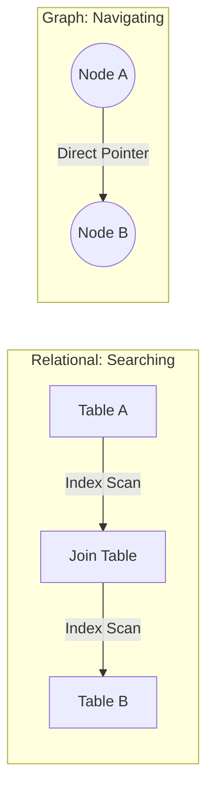

# Neo4j Master Architect: The Graph Paradigm

> "In a world of data, connections are more valuable than the data itself."

This repository is a structured roadmap to mastering **Neo4j** by leveraging your existing expertise in **Postgres (Relational)** and **Mongoose (Document)**.

## Why Neo4j? (The 1% Perspective)

Most developers use Neo4j because "it's cool for social networks." **The 1% use it because of Index-Free Adjacency.**

### 1. The Performance Chasm
In traditional databases, finding relationships is a **Search** problem. In Neo4j, it is a **Navigation** problem.

- **Postgres (Joins):** To find a friend-of-a-friend, the engine must search a B-Tree index ($O(\log N)$). As your data grows to billions of rows, your joins get exponentially slower.
- **Neo4j (Pointers):** To find a friend-of-a-friend, the engine follows a physical memory address (pointer). The cost is **$O(1)$ per hop**. It doesn't matter if you have 1 thousand nodes or 1 trillion; the speed of the hop is constant.

### 2. Comparative Paradigms

| Feature | Postgres (SQL) | MongoDB (NoSQL) | Neo4j (Graph) |
| :--- | :--- | :--- | :--- |
| **Mental Model** | Ledger/Accounting | Folder/Document | Network/Brain |
| **Join Cost** | High (Index scans) | Very High ($lookup) | **Near Zero (Pointers)** |
| **Data Shape** | Rigid Tables | Nested Trees | Interconnected Web |
| **Sweet Spot** | Standard CRUD/Reporting | Content Management | **Deep Insights/Paths** |

### 3. Structural Visualization

**Neo4j wins because it stores the connection physically on disk alongside the data, whereas SQL calculates the connection at runtime.**

---

## Case Studies: The 1% Decision

### ✅ Use Neo4j When:
1. **Real-Time Recommendations (Retail):**
   - **Scenario:** "Customers who bought this also bought..." based on a 5-hop path of shared categories and brands.
   - **Why:** SQL joins would timeout; Neo4j traverses the purchase graph in milliseconds.
2. **Fraud Detection (Banking):**
   - **Scenario:** Identifying "Synthetic Identity" rings where multiple users share the same SSN, IP address, and Phone number.
   - **Why:** This is a "Circle" detection problem. Neo4j's GDS algorithms (like Weakly Connected Components) find these clusters instantly.
3. **Master Data Management (Supply Chain):**
   - **Scenario:** A "Bill of Materials" (BOM) that is 20 levels deep. You need to know every sub-component affected by a single part failure.
   - **Why:** Recursive CTEs in SQL are hard to maintain and slow. Neo4j handles variable-depth paths natively.

### ❌ Do NOT Use Neo4j When:
1. **High-Volume Log Analysis:**
   - **Scenario:** Storing 50TB of server logs for periodic security audits.
   - **Why:** Logs are linear and flat. Neo4j's overhead for relationship pointers is wasted here. Use **ElasticSearch** or **ClickHouse**.
2. **Standard Accounting/Ledgers:**
   - **Scenario:** Processing millions of double-entry bookkeeping transactions.
   - **Why:** This requires rigid tabular integrity and massive aggregations (SUM/AVG). **Postgres** is optimized for this; Neo4j is not.
3. **Simple Blog/CMS:**
   - **Scenario:** Storing articles, tags, and comments for a personal site.
   - **Why:** The relationships are shallow (1-hop). The RAM requirements of Neo4j outweigh the benefits. Use **Mongoose** or **Postgres**.

## The Trade-offs: What to Watch For

The 1% Architect knows that Neo4j isn't free. Its power comes with specific costs:
- **The RAM Tax:** Performance is directly tied to available memory for the Page Cache.
- **Write Latency:** Higher than NoSQL due to pointer maintenance.
- **The Supernode Problem:** Dense nodes can kill query performance if not modeled correctly.
- **Scaling:** Vertical scaling is easy; horizontal write-scaling is complex.

---

## Roadmap Overview

This roadmap is divided into 6 strategic phases:

1.  **[Foundations](./roadmap/01_foundations.md):** Index-Free Adjacency & Cypher basics.
2.  **[Modeling](./roadmap/02_modeling.md):** Breaking the "Relational" habit.
3.  **[Optimization](./roadmap/03_advanced_cypher.md):** Reading execution plans (`PROFILE`).
4.  **[GDS Algorithms](./roadmap/04_gds.md):** Pathfinding, PageRank, and Community Detection.
5.  **[Production](./roadmap/05_real_world.md):** Scaling, Drivers, and Causal Clustering.
6.  **[Selection Criteria](./roadmap/06_selection_criteria.md):** Architectural decision-making (Polyglot design).

## The 1% Architect's Golden Rule
> **"Never use a Graph for flat data, and never use a Table for deep relationships."**

---
*Created for the journey to the top 1% of Neo4j Developers.*
